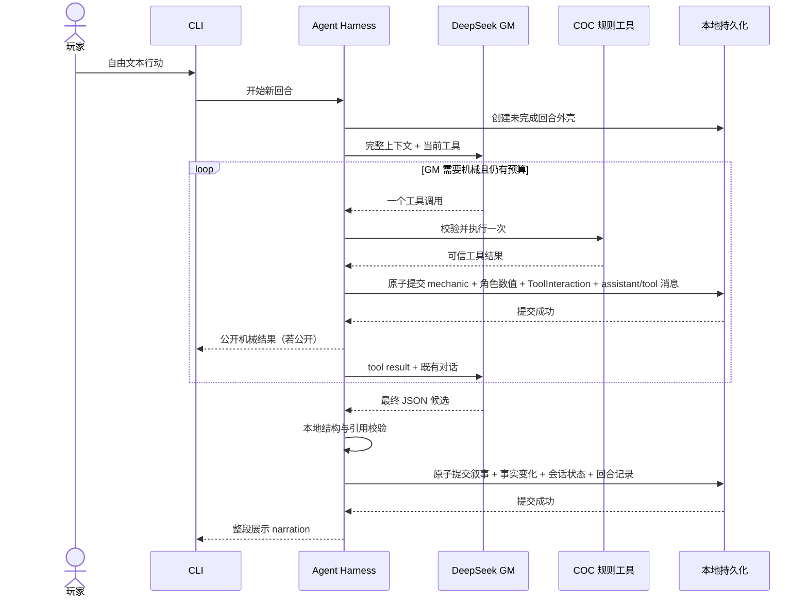
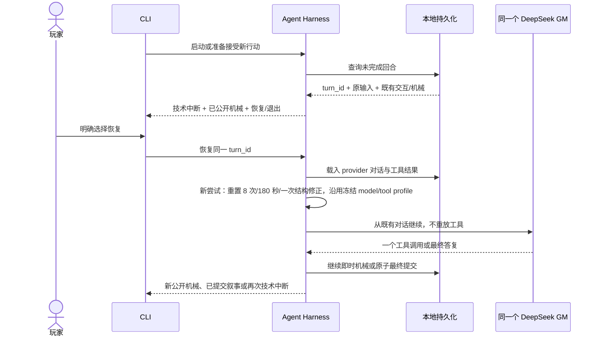

# 单一 GM Agent Loop

## 文档状态

本文定义下一版 MVP 一次玩家输入如何经过同一个 GM、COC 工具、最终校验、提交、故障和显式恢复。模块职责以[系统架构](architecture.md)为准，字段和错误结构以[数据契约](contracts.md)为准，GM 行为依据[GM 能力章程与 Prompt](gm_prompt.md)。

本文描述完整的**目标协议**。截至 2026-07-31，opt-in Agentic 路径已实现新回合外壳、non-thinking DeepSeek 消息、一次 `make_check` 往返、机械即时提交、最终事实/叙事原子提交和技术中断保存；默认旧循环仍返回 `GameMasterDraft(strategy, narration, suggested_actions)` 并使用 `request_check` / `apply_effect`。Agentic 路径尚未实现正式恢复入口、单次结构修正、`attempt_timeout_seconds=180`、八次往返执行和 thinking 消息回放，因此不能把下文完整恢复协议当作当前能力。

## 循环切片

每轮只有一个连续的 GM Agent Loop：

```text
玩家输入
  -> Harness 创建或恢复同一个回合
  -> 同一个 GM：调用一个 COC 工具，或提交最终答复
       -> Harness 立即结算并保存机械结果
       -> 结果返回同一个 GM
       -> 重复选择
  -> Harness 本地校验最终答复
  -> 原子提交叙事、事实变化、会话状态与完整回合记录
  -> CLI 展示已提交内容
```

循环内部没有输入 router、planner、critic、validator Agent、Memory Agent、角色 Agent、固定 OODA 阶段或 `fast` / `dramatic` / `urgent` 策略。GM 可以在自己的推理中使用任何主持方法，但运行时只观察“工具调用”或“最终答复”两种外部动作。

## 核心术语

### 新回合

一次新的玩家自由文本输入及其因果裁定。Harness 为它分配稳定 `turn_id`，并在第一次模型请求前保存回合外壳。存在未完成回合时不能创建新回合。

### 执行尝试

Harness 从接受新玩家输入或玩家明确选择恢复开始，到成功提交最终答复或发生技术中断为止的一次运行。恢复沿用原 `turn_id`，但开启新的执行尝试。

每次执行尝试拥有独立的：

- 最多 8 次模型往返。
- 180 秒整次尝试时限。
- 最多一次自动最终结构修正。

累计尝试次数、往返、延迟与结构修正只用于诊断。恢复不会清除既有模型/工具交互，也不会撤销或重放已提交机械。

### 模型往返

Harness 向同一个 GM 发出一次模型请求并收到一次响应，计为一次往返。以下响应都计入 8 次额度：

- 初始 GM 响应。
- 工具结果送回后的继续响应。
- 协议错误送回后的纠正响应。
- 最终答复结构修正响应。

本地执行 COC 工具不计模型往返。若一个响应包含多个 `tool_calls`，整个响应仍只计一次，但其中工具一个也不执行。

### 未完成回合

已经创建 `turn_id`，但尚未成功提交合法 GM 最终答复的回合。它可能已经包含不可回滚的机械结果，也可能在第一次机械产生前就因 provider 故障中断。未完成回合是恢复入口，不是失败叙事或新回合。

## 回合不变量

每次执行都必须保持：

1. 同一时刻只有一个 GM、一个串行回合写入者。
2. 每个模型响应只能是一个 COC 工具调用或一个最终答复。
3. GM 决定是否调用机械及其事前参数；Harness 产生并提交结果。
4. 机械成功后立即持久化，随后模型失败也不回滚；机械、幂等映射和 provider 协议消息属于同一次原子工具提交。
5. GM 最终叙事和全部事实变化一起提交，不存在部分叙事成为正典。
6. 玩家主动检定与调查员数值变化公开；Harness 结构强制调查员数值变化公开，但不做自然语言意图分类；秘密机械必须在结果产生前标记隐藏。
7. 玩家决定是否孤注一掷或花费幸运；GM 只能说明机会和事前风险。
8. GM 明确叙述建立正典；事实索引帮助回忆，但不是叙述许可层。
9. 未校验输出、隐藏事实、隐藏机械与 provider 推理不进入玩家界面。
10. 故障产生技术中断和可恢复记录，不产生 Harness 编写的剧情。

## 新回合预检与上下文

CLI 在接收玩家行动前先查询是否有未完成回合。没有未完成回合时，Harness 执行以下步骤：

1. 新游戏先完成 `SessionSetup` 的原子初始化：复制并校验模组/人物只读快照，写入开场事实、角色卡、`actor_display_names` 和 `investigator_profile`；CLI 展示 `setup.opening_narration`，不发起没有玩家输入的 GM 回合。
2. 校验正式调查员卡、持久化目录和模型运行配置可用；哈希不符时不能退回读取已经变化的工作树文件。
3. 确认短篇仍为 `ongoing`，且当前没有另一个写入中的回合。
4. 接受玩家原文，生成稳定 `turn_id`，并持久化状态为未完成的回合外壳。
5. 启动第一次执行尝试，记录 180 秒 deadline、8 次往返余额和一次结构修正余额。
6. 组装本轮初始 GM 上下文。

初始上下文完整提供：

- 主持能力章程及最终答复格式。
- 不可变 `SessionSetup` 的开场记录与玩家冻结的 `InvestigatorProfile`。
- 《逃离塔纳里昂》完整 Markdown 模组参考书。
- 调查员与 NPC 参考资料、正式调查员卡，以及所有参与可信机械的 NPC 角色卡。
- 当前全部公开和隐藏事实。
- 本局从开场至上一回合的完整游戏记录和精简机械结果。
- 本轮玩家原文。
- 当前已经实现的 COC 工具定义。

完整游戏记录不包含模型隐藏推理。首个纵向切片只暴露 `make_check`；后续增量再加入 `push_check`、`spend_luck`、`deal_damage` 和 `make_sanity_check`。

## 正常时序



GM 可以在第一次响应直接给出最终答复，因此不需要为了维持流程而制造检定。工具调用数量不对应虚构行动数量；唯一固定上限是执行尝试的模型往返、请求等待和总时限。

## 模型响应协议

`GameMasterModel` seam 先返回保留完整 assistant 消息的 `ModelResponse` envelope；以下分支是 Harness 对该 envelope 的本地分类。adapter 不会在遇到多个工具调用时提前丢弃 provider 消息，因此恢复和协议回传仍有完整依据。

每个 DeepSeek assistant 响应必须解析为以下之一：

### 一个工具调用

响应只包含一个当前提供的 function tool call。`tool_call_id` 只有在它是首尾无空白的非空 JSON 字符串时才可用于协议关联；若缺失或不可用，Harness 在同一次原子写入中追加受限 `provider_protocol_errors` 原始记录、设置稳定的 `last_failure` code/message，保持 `deepseek_messages` 的最后一个可回放前缀，不创建 `ToolInteraction` 或合成 tool 消息，并保留未完成回合后中断。具有可用 ID 时，Harness 再校验名称、参数与本局状态，然后执行或返回结构化工具错误。

### 一个最终答复

响应提供 JSON Object，顶层只包含：

- `narration`
- `establish`
- `retire`
- `session_status`

GM 不复制工具结果，不提交 `turn_id`、事实 ID、工具轨迹、诊断、固定建议菜单、策略或结局 ID。Harness 从真实运行数据构造调用层结果。

### 多个工具调用

若同一响应包含多个 `tool_calls`，Harness：

1. 将该响应计为一次模型往返。
2. 保留完整 assistant 消息，一个工具也不执行，因此不会出现一半已经掷骰、另一半被拒绝的状态。
3. 当所有 `tool_call_id` 都可用且互不重复时，为每个 ID 追加对应的 `role: "tool"` 消息和 `ok: false`、`code: "multiple_tool_calls_not_allowed"` 错误；这些消息与 `ToolInteraction` 在同一次原子写入中保存。响应内 ID 不可用或重复时，只在受限 `provider_protocol_errors` 中保存序列化原始响应和 provider 协议错误，保持最后一个可回放消息前缀，不写入可回放的 assistant/tool 对。
4. 只有可逐 ID 回传错误的多工具响应，才在本次尝试仍有往返和时限时请求同一个 GM 重新选择一个工具或给出最终答复；ID 无法关联或没有下一次额度时保留未完成回合并中断。

这是一项因果与恢复约束，不是对 GM 可裁定内容的限制。

## 工具分支

### 通用步骤

收到一个工具调用后，Harness 按以下顺序处理：

1. 检查工具是否在本轮提供的定义中，并按[数据契约](contracts.md)校验参数。
2. 检查 `tool_call_id` 是否已经处理；相同 ID 和相同规范参数只复用已保存结果，不同参数直接返回协议错误。
3. 调用 COC 规则模块，从正式角色卡和既有机械记录读取权威输入。
4. 若调用合法，产生随机结果并计算规则；若参数或领域校验失败，构造稳定错误，不产生随机数。
5. 在一次完整 `session.json` 原子替换中同时写入 assistant tool-call、`ToolInteraction`、对应 tool result 消息、成功机械记录和角色数值变化（或失败错误交互）。写入成功后才向 GM 或 CLI 报告结果。
6. 若结果公开，立即向 CLI 发布独立的机械输出。
7. 将已经提交的完整结果及原 `tool_call_id` 继续加入同一 GM 对话。

参数或领域校验失败时，不掷骰、不改变数值，返回可操作的结构化错误。GM 可以在剩余预算内修正调用或根据当前虚构完成回合。Harness 不把工具拒绝改写成剧情结果。

### `make_check`

GM 在结果产生前提供行动者、角色卡中的技能或属性、常规/困难/极难难度、奖励或惩罚骰、行动说明、风险说明和可见性。Harness：

- 从正式角色卡读取能力值，不接受 GM 提交目标值。
- 验证能力与难度，掷 d100 并计算 COC 成功等级。
- 生成不可重用的机械记录 ID，持久化骰点、目标、成功等级与事前参数。
- 将结果返回 GM，由 GM 决定它在当前虚构中造成什么后果。

`make_check` 不接收模组目标、规则 ID、效果 ID、任意数字修正或预写剧情效果。

### `push_check`

孤注一掷通常跨两个玩家回合完成：第一次失败后，GM 在已提交叙事中说明机会；玩家在下一条输入中提出不同做法并明确接受风险。GM 负责理解这项玩家选择，随后调用 `push_check`，引用原失败检定并在结果产生前说明更严重的失败风险。Harness 只验证关联、规则适用性和一次性结算，不建设自然语言意图分类器。

GM 不自动替玩家孤注一掷。孤注一掷结果不是对原骰点的覆盖，两次机械记录都保留。

### `spend_luck`

只有玩家在当前输入中明确选择花费幸运时，GM 才调用 `spend_luck`。Harness 验证原检定是否允许调整、所需点数与余额，然后立即更新幸运并生成机械记录。GM 不能在叙事中代替玩家补做该选择。

### `deal_damage`

GM 根据已经成立的虚构提供伤害表达式、原因和适用护甲。Harness 掷伤害、应用护甲、更新 HP，并报告重伤、昏迷或死亡等规则阈值；GM 负责将这些机械事实表现为具体虚构后果。

### `make_sanity_check`

GM 根据恐怖来源提供成功和失败的 SAN 损失表达式以及事前可见性。Harness 完成理智检定、结算 SAN 并报告相关规则阈值；GM 负责主持其感官、行为和故事表现。

## 机械提交与玩家输出

COC 工具采用“先持久化，后报告”：

- 成功工具调用的随机数与数值变化立即成为机械权威。
- 工具成功响应、CLI 公开结果和送给 GM 的 tool result 都源自同一持久化记录。
- 后续请求超时、最终 JSON 无效或玩家退出都不会回滚机械。
- 隐藏结果只是暂不显示给玩家，仍会持久化并返回 GM。

CLI 可以在模型循环仍继续时显示公开机械，因为该结果已经提交。它不能显示 GM 正在生成的 token、未校验 JSON、隐藏事实或最终叙事片段。

## 最终答复校验与提交

### 本地校验范围

Harness 在完整接收非流式响应后校验：

- JSON 可以解析且顶层结构符合最终答复契约。
- `narration`、`establish`、`retire` 和 `session_status` 的类型、枚举与必填字段正确。
- 每个 `retire` 引用当前有效且可结束的稳定 `fact_id`。
- 同一批事实变化没有重复引用或无法原子应用的结构冲突。
- 最终答复没有伪造 Harness 所拥有的机械、ID、轨迹或诊断字段。

Harness 不以模组是否预写、路线是否预定、叙事是否合意为由拒绝答复，也不调用第二个 LLM 判断语义质量。正典连续性与主持质量由能力章程和[真实评估](evaluation.md)约束。

### 单次结构修正

若最终答复未通过本地 schema 或引用校验，Harness 在满足以下条件时自动修正一次：

1. 本次执行尝试尚未使用结构修正机会。
2. 8 次往返额度和 `attempt_timeout_seconds=180` 仍允许下一次模型请求。

Harness 把简短、具体的校验错误送回同一个 GM，请它只重新提交最终结构。修正请求：

- 沿用原玩家输入、完整上下文、既有模型消息和全部工具结果。
- 不执行、重放或撤销已完成工具。
- 从修正请求移除 function tools，或以 `tool_choice: none` 强制无工具；该响应只按完整最终 JSON 接收。
- 作为一次新的模型往返计入 8 次额度。
- 不引入第二个修复模型或 semantic critic。

修正后的答复仍无效，或者没有剩余预算时，本次执行尝试中断并保留未完成回合。玩家显式恢复会开启新执行尝试，因此重新获得一次结构修正机会；累计修正次数保留为诊断。

### 原子最终提交

最终答复通过校验后，Harness 在一个原子提交中：

1. 为 `establish` 中的新事实分配稳定 `fact_id`，记录公开/隐藏可见性、`origin.kind: "gm_turn"` 和来源回合。
2. 按 `retire.fact_id` 结束旧事实并保存原因，不删除其历史。
3. 写入玩家原文、精简机械结果、`narration`、事实变化和 `session_status` 组成的完整回合记录。
4. 更新当前事实索引和会话状态。
5. 标记该 `turn_id` 完成并清除未完成阻塞。

上述写入要么全部成功，要么都不生效。机械结果不包含在这个事务中，因为它们已在各自工具调用时提交。

提交成功后，CLI 才整段展示 `narration`。公开 `establish` 的内容通常已经体现在叙事中，不需要把事实账本作为第二份玩家文案打印；隐藏事实不会进入玩家输出。

## 非流式输出边界

首版所有 DeepSeek Chat Completion 使用非流式请求。原因不是 CLI 不能显示逐字文本，而是 GM 最终响应同时携带玩家叙事和隐藏事实，必须先满足本地结构并完成原子提交。

玩家可见输出分为三类：

| 输出 | 展示时机 |
| --- | --- |
| 公开 COC 机械结果 | 对应工具成功持久化后立即展示 |
| GM `narration` | 最终答复校验并原子提交后整段展示 |
| 技术中断与恢复提示 | 执行尝试失败并保存未完成回合后展示 |

Provider token 流、`reasoning_content`、隐藏机械、隐藏事实、无效最终 JSON 和内部工具轨迹不进入普通玩家输出。未来若增加 streaming，必须另行定义“什么文本已经提交”的安全协议，不能把 provider 数据流直接连接 CLI。

## 运行保险丝

### 八次模型往返

每次执行尝试默认最多 8 次模型往返。收到第 8 个响应后：

- 如果它是合法最终答复，Harness 仍可以本地校验并提交。
- 如果它包含一个合法工具调用，Harness 仍按通常步骤即时执行并原子保存机械与协议交互；由于没有第 9 次模型响应额度，随后保存未完成回合并技术中断，玩家恢复时从该 tool result 继续。
- 如果它包含一个缺少可用 `tool_call_id` 的工具调用，Harness 只在受限 `provider_protocol_errors` 中保存序列化原始响应和 provider 协议错误，不创建 `ToolInteraction` 或 tool 消息，并直接保存未完成回合后中断；显式恢复从最后一个可回放前缀重试。
- 如果它包含多个工具调用或最终结构无效，已经没有下一次模型响应额度；多工具响应仅在所有 `tool_call_id` 都可用且互不重复时按上文逐个追加错误消息，ID 缺失、不可用或重复时只保存受限原始响应记录和 provider 协议错误。无论哪种情况，本次尝试都直接保存未完成回合并中断。

这个上限不限制 GM 可以确立多少事实或裁定何种内容，也不要求它在接近上限时仓促结束故事。

### 单请求 60 秒

每个 DeepSeek 请求默认最多等待 `request_timeout_seconds=60`。实际等待上限还受本次尝试剩余的 `attempt_timeout_seconds=180` 约束。请求超时后不追加补偿性模型调用，本次执行尝试直接中断。

### 整次尝试 180 秒

计时从 Harness 接受新玩家输入或玩家明确恢复开始，到最终答复成功提交为止。Harness 在发起下一次 provider 请求和开始最终提交前检查剩余时间；已经开始的本地原子写入不会被中途拆断。

恢复是新的执行尝试，因此重新获得 8 次往返与 180 秒。累计次数仍记录，便于评估费用和异常循环，但不会让一次步骤超限变成永久无法恢复的回合。

这些默认值可在真实 DeepSeek 延迟轨迹表明不合适时调整；配置变化不改变故障与恢复语义。

## 故障处理

| 故障 | 已提交机械 | 最终叙事/事实 | 本次尝试结果 |
| --- | --- | --- | --- |
| 工具参数或领域校验失败 | 无新增 | GM 可在剩余预算内继续 | 结构化错误返回同一 GM |
| 单工具调用缺少可用 `tool_call_id` | 无新增 | 不提交 | 只保存受限原始响应记录与 provider 协议错误并中断；恢复从最后一个可回放前缀重试 |
| 多个 `tool_calls`，ID 全部可用且唯一 | 一个也不执行 | 无新增 | 为每个调用追加协议错误 tool result；无余额则中断 |
| 多个 `tool_calls`，任一 ID 缺失、不可用或重复 | 一个也不执行 | 不提交 | 只保存受限原始响应记录与 provider 协议错误并中断；恢复从最后一个可回放前缀重试 |
| DeepSeek 鉴权、限流、服务端或网络错误 | 保留 | 不提交 | 保存未完成回合并技术中断 |
| 单请求超过 60 秒 | 保留 | 不提交 | 保存未完成回合并技术中断 |
| 执行尝试超过 180 秒 | 保留 | 不提交 | 保存未完成回合并技术中断 |
| 第 8 次响应仍未产生合法最终答复 | 保留 | 不提交 | 保存未完成回合并技术中断 |
| 最终结构首次无效 | 保留 | 不提交 | 有预算时由同一 GM 修正一次 |
| 最终结构修正仍无效 | 保留 | 不提交 | 保存未完成回合并技术中断 |
| 最终原子提交失败 | 保留 | 全部不提交 | 保存未完成回合并技术中断 |

任何一项技术故障都不让 Harness 猜测 GM 原本想说什么，也不生成“系统暂时无法完成叙事”之类的世界内兜底剧情。CLI 显示明确的技术状态即可。

## 显式恢复时序



恢复必须满足：

- 使用同一个 `turn_id`、原玩家输入和同一局正典，不创建新回合。
- 不接受新的游戏行动；玩家若退出，未完成回合仍保留到下次启动。
- 沿用 `IncompleteTurn.model_profile`、`attempt_limits`、Prompt 修订、工具 schema 版本和启用工具列表；若冻结版本不可用则报错，不静默切换 provider 配置。
- 恢复同一模型对话所需的可回放 assistant/tool 消息及 `tool_call_id` 对应关系；不可配对的原始 provider 响应不加入发送前缀。
- thinking 模式下原样恢复 DeepSeek 所要求的 `reasoning_content`，但不向玩家或游戏记录暴露。
- 已处理的工具调用从持久化结果恢复。相同 `tool_call_id` 和相同参数只返回原结果；相同 ID 搭配不同参数属于协议错误。
- 已经向玩家公开的机械可以在恢复提示中重显，但不得当作一次新结算再次追加。
- 新执行尝试重新获得运行预算，累计尝试和费用诊断不重置。
- 只有最终答复成功原子提交后，CLI 才解除对新玩家行动的阻塞。

## 玩家选择与跨回合机械

Agent Loop 不在一次模型调用中暂停等待玩家确认。需要玩家决定的 COC 机会按正常回合表达：

1. GM 在当前最终叙事中说明失败、可孤注一掷的机会与需要先说明的风险，或提示规则允许花费幸运。
2. 当前回合正常提交。
3. 玩家下一条自由文本明确选择、拒绝或采用其他行动。
4. 新回合中的同一个 GM 根据玩家选择调用 `push_check` 或 `spend_luck`。

这样玩家决定权保持在普通输入 seam，不需要另建审批状态机或特殊 UI 表单。

## 验收场景

### 无需检定的未预写行动

玩家提出参考书没有预设、但在当前虚构中合理且结果明确的行动。GM 不调用工具，直接叙述结果并 `establish` 一个持续事实；下一回合仍依据它主持。

### 需要检定的未预写行动

玩家提出有真实风险和不确定性的怪招。GM 调用 `make_check`，Harness 从角色卡结算并公开结果；GM 不寻找模组目标或效果 ID，而是依据事前风险和结果裁定新事实。

### 工具后超时

`make_check` 已提交并向玩家公开，下一次 DeepSeek 请求超时。Harness 不输出未校验叙事，保存未完成回合。恢复后 GM 收到原检定结果，完成同一回合，不重掷。

### 最终结构修正

GM 第一次最终 JSON 缺少 `session_status`。Harness 返回具体 schema 错误，同一 GM 在剩余预算内修正一次；只有第二份合法答复被原子提交，第一份文案与事实均不生效。

### 多工具响应

DeepSeek 同一响应请求 `make_check` 和 `deal_damage`。Harness 两者都不执行，为两个 `tool_call_id` 各保存并返回一个协议错误；GM 下一响应选择先执行一个工具，观察结果后再决定下一步。

### 重复恢复

同一未完成回合连续两次恢复都在最终提交前失败。每次恢复使用新执行预算，但机械记录数量、HP/SAN/幸运与已公开结果保持不变；第三次恢复仍从同一 `turn_id` 继续。

## Loop 验收条件

- 一次玩家输入只驱动一个 GM Agent Loop，NPC 与队友由这个 GM 直接扮演。
- 每个 assistant 响应只执行零或一个 COC 工具；多个调用不会产生部分机械结果。
- 所有成功工具结果连同 `ToolInteraction`、角色数值和 assistant/tool 消息在返回 GM 前原子持久化，并在恢复后保持幂等。
- 最终答复严格使用四个顶层字段，Harness 不从自由文本中另行抽取事实。
- 最终叙事与事实变化原子提交；无效或未提交内容对玩家不可见且不成为正典。
- 非流式 DeepSeek 输出、8 次往返、`request_timeout_seconds=60`、`attempt_timeout_seconds=180` 和每次尝试一次结构修正均有可观察测试。
- 技术故障保留机械并产生可恢复的未完成回合，不生成兜底剧情。
- CLI 在未完成回合存在时不接受新行动，只有玩家明确选择才发起恢复模型调用。
- 首个真实纵向切片证明未预写行动能够建立事实并跨两个回合连续成立。
