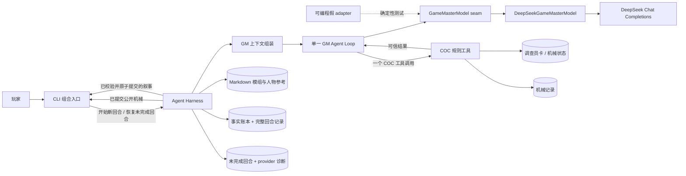

# Agentic MVP 系统架构

## 文档状态

本文定义下一版 MVP 的目标模块、接口、seam、权威与数据流。执行时序以 [Agent Loop](agent_loop.md) 为准，持久化与消息字段以[数据契约](contracts.md)为准，产品取舍以 [MVP 产品方案](mvp_design.md)为准。

本文定义目标架构，不把未交付能力写成当前事实。截至 2026-08-16，独立的 opt-in Agentic 路径已通过 `AgenticHarness.start_turn`、`resume_turn`、`AgenticSessionStore` 和 `GameMasterModel` seam 实现 Increment 1 至 Increment 3，包括最终答复、事实账本、完整回合记录、五工具 COC 机械、六张生产角色卡、non-thinking/thinking DeepSeek adapter、显式恢复、幂等工具结果重放、结构修正、执行限制和真实恢复合同证据。动态 COC 工具注册目录已统一到同一 `CocTool` 生命周期，`PublicMechanic` 由各工具自己的 `public_details` 生成，恢复继续使用未完成回合冻结的 `model_profile` 并由完整注册表逐项验证；Ticket 18 场景二和场景三已在 2026-08-16 由项目所有者采纳通过。默认入口及 `agent.py`、`engine.py`、`tools.py`、`rules.py`、`state.py` 仍保留旧规则驱动基线；已有完整会话的继续入口、完整短篇六场景与开放试玩、模型评估矩阵、默认入口切换和旧路径清理仍是目标架构。

## 架构目标

架构只为 GM 主持能力提供必要支撑：

- GM 是虚构世界、NPC、因果与正典的裁定者，而不是规则表的效果选择器。
- 玩家拥有调查员的主动意志。
- Harness 使 COC 机械、持久化和恢复可信，但不审批故事是否允许发生。
- 每轮只有一个持续工作的 GM；工具结果返回同一个 GM 后，它继续主持。
- 模组全文与本局完整记录直接进入上下文，暂不增加检索、摘要或 Memory Agent。
- 外部变化只存在于 DeepSeek 模型调用 seam；本地规则与存储作为 Harness 内部深模块实现。
- 运行限制是费用与可靠性的保险丝，不成为虚构内容或工具使用的剧情预算。

## 架构总览



图中的名称表示职责模块，不要求一项职责对应一个类、进程或文件。对 CLI 而言，Agent Harness 是主要深模块；COC 规则、事实/回合存储和上下文组装都在其内部保持局部，不扩散为调用层必须理解的一组浅接口。

## 权威分配

| 问题 | 权威 | 说明 |
| --- | --- | --- |
| 调查员要做什么、说什么、相信什么 | 玩家 | GM 可以补全已声明行动的自然细节，不能增加新的重大选择 |
| 世界如何回应、NPC 如何行动、结果在虚构中意味着什么 | GM | 可以采用、改编或舍弃尚未确立的参考条目，也可以创造新内容 |
| 骰点、成功等级、HP、SAN、幸运及规则阈值 | Agent Harness 内的 COC 规则工具 | 从正式角色卡取值并立即提交，GM 只能忠实解释 |
| 什么是本局已经发生的正典 | 已提交的完整游戏记录 | `SessionSetup` 的开场事实和 GM 的明确叙述/隐藏裁定在提交后生效；事实索引只是当前投影 |
| 哪些持续事实仍在描述当前世界 | 自然语言事实账本 | GM 提交 `establish` / `retire`，Harness 分配 ID、校验引用并持久化 |
| 参考书里的普通条目是否在本局成立 | GM；开场最小正典由 `SessionSetup` 载入 | 参考书提供素材，不是事实预载、路线图或权限来源；setup 只保留最小初态 |
| 本轮能否安全继续、提交或恢复 | Agent Harness | 根据结构、持久化状态、时限和步骤保险丝判断，不评价叙事好坏 |
| 短篇是否形成收束 | GM 的 `session_status` | 值为 `ongoing` 或 `complete`，不映射枚举结局 |
| 玩家能看到什么 | CLI 根据可信可见性投影 | 不显示隐藏事实、隐藏机械、provider 推理或内部诊断轨迹 |

权威分配不是一张禁止 GM 创作的清单。它的目的，是让 GM 对虚构拥有更大空间的同时，不必自己实现随机数、COC 算法、文件事务和恢复幂等。

## 核心模块与接口

### CLI 组合入口

CLI 是唯一正式玩家界面，也是依赖组装位置。它负责：

- 选择或创建一局游戏并装配运行配置、DeepSeek adapter 与本地 Harness。
- 在接受新行动前查询未完成回合；若存在，只显示“继续恢复”与“退出”两种运行选择。
- 把玩家自由文本提交给 Harness，并把公开机械、已提交 GM 叙事和技术中断清楚分区展示。
- 在玩家选择恢复后，明确发起同一 `turn_id` 的新执行尝试；启动程序本身不产生模型调用或费用。

CLI 不解析玩家意图，不选择工具，不建立世界事实，也不直接读写机械状态。对调用层，Harness 只需提供两项概念能力：“开始新回合”和“恢复未完成回合”；本阶段不冻结 Python 方法名。

### Agent Harness

Agent Harness 是运行时的主要深模块。它把复杂的上下文、模型循环、工具、提交和恢复隐藏在上述两项能力之后。

职责：

- 创建新游戏时先验证六张生产 `ActorSheet` 模板与技能目录，再原子写入 `SessionSetup`、按内容哈希寻址的模组/人物只读快照、开场事实、`actor_display_names`、选中调查员的 `InvestigatorProfile`，以及选中调查员和三名固定同行者共四张机械角色卡；未选调查员模板不复制进本局。CLI 展示开场叙述后才接受第一条玩家输入。
- 确认当前会话允许创建新回合，生成稳定 `turn_id`，并在首次模型请求前保存可恢复的回合外壳。
- 从主持能力章程、不可变参考书快照、人物资料、选中调查员与参与可信机械的 NPC 角色卡、当前事实、本局完整记录、玩家原文和工具定义组装 GM 上下文。
- 驱动同一个 GM 的有限模型往返，执行它选择的一个 COC 语义工具，随后把可信结果送回同一对话。
- 对每个新工具调用统一执行“参数规范化、领域 preflight 与可信输入冻结、分配 Harness ID/时间、执行 RNG/规则、原子持久化、公开投影”；任何领域拒绝都发生在 ID、时间和 RNG 之前。
- 在 COC 工具成功后，把机械记录、角色数值变化、`ToolInteraction` 和 assistant/tool 协议消息一次原子持久化，再由实际工具选择允许公开的字段并向 CLI 发布统一 `PublicMechanic` 投影。
- 本地解析和校验 GM 最终答复；只校验结构、引用和可原子写入性，不审批虚构内容。
- 将 `narration`、`establish`、`retire`、`session_status` 与回合记录作为一个最终提交写入，并刷新事实索引。
- 维护每次执行尝试的 8 次模型往返、60 秒单请求时限、180 秒执行尝试时限和一次最终结构修正，并按冻结的 `retry_policy` 对可重试 provider 错误做有界重试。
- 保存未完成回合及冻结的 `model_profile` / `attempt_limits`，恢复 provider 对话和既有工具交互，并保证已提交机械不被重放。新回合默认暴露五个 COC 工具；恢复回合使用自己的冻结 profile，只要求其版本与工具子集仍被完整注册表支持，不要求它等于新回合默认 profile。冻结 profile 不可用或损坏时拒绝恢复，不静默换配置。
- 记录用量、延迟、错误和累计恢复次数等诊断数据，同时从玩家视图和正典记录中隔离这些信息。

Harness 不需要先知道“世界中哪些变化被允许”。如果最终答复结构合法、引用事实存在且可以完整写入，它就接受 GM 的裁定。叙事质量、连续性和玩家意志边界通过[GM 能力章程与 Prompt](gm_prompt.md)、真实评估与试玩改进，不增加一个语义审核 Agent。

MVP 的 CLI 串行运行：一局同时只有一个写入者，一个未完成回合会阻塞新的玩家行动。这使机械即时提交和最终答复原子提交可以在本地保持清楚的顺序，不需要提前建设分布式事务或并发框架。

### GM Agent Loop

GM Agent Loop 是 Harness 内部唯一由 LLM 驱动的循环，不是由多个阶段或多个 Agent 组成的工作流。每次模型响应只能选择：

1. 调用一个当前提供的 COC 工具；或
2. 返回一个 GM 最终答复。

收到工具结果后，仍由同一个 GM 根据完整对话决定下一步。循环不产生 `strategy`、OODA 状态、固定建议菜单或角色生成任务。GM 直接扮演所有 NPC 与队友。

循环结束条件、工具分支、最终结构修正和恢复过程详见 [Agent Loop](agent_loop.md)。

### `GameMasterModel` seam

`GameMasterModel` 是核心与外部模型提供方之间唯一需要保留的薄 seam。它表达一次非流式模型往返所需的信息，并返回保留完整 assistant 消息的 `ModelResponse` envelope；Harness 再把它分类为一个工具调用、最终答复、多个工具调用或 provider 协议错误。调用者不需要理解 DeepSeek 的 SDK 对象；恢复时由 Harness 传入 `IncompleteTurn` 冻结的 `model_profile` 与工具 schema 版本，adapter 不得静默替换。

这个 seam 有两个真实用途不同的 adapter：

- `DeepSeekGameMasterModel`：生产与真实契约测试使用。
- 可编程假 adapter：确定性构造工具调用、超时、无效结构和恢复路径。

两种 adapter 足以让这个 seam 成立；MVP 不因此增加 provider 注册表、能力探测、自动降级链或统一多提供商抽象。

### `DeepSeekGameMasterModel`

DeepSeek adapter 使用 OpenAI Python SDK：

```python
OpenAI(
    api_key=deepseek_api_key,
    base_url="https://api.deepseek.com",
    max_retries=0,
)
```

它调用 `client.chat.completions.create(...)`，不使用 OpenAI Responses API。模型 ID、thinking 模式和 API key 由组合入口显式传入；adapter 不决定凭据来自哪里，也不把 key 写入日志或存档。

Adapter 负责：

- 把稳定的 GM 上下文、工具定义和既有交互转换为 DeepSeek Chat Completions 消息。
- 在正常请求中同时提供当前 function tools 与 JSON Object response format，并按 `tool_calls` 或最终 content 分支解析响应。
- 保留 assistant `tool_calls`、对应 `tool_call_id` 和 tool result 的协议关联。
- 把 DeepSeek 响应解析为保留完整 assistant 消息的 `ModelResponse`；Harness 决定单工具、最终 JSON、多个工具或协议错误分支。
- 鉴权、限流、网络、请求超时和无法形成 assistant 消息的 SDK 响应以稳定 `ModelCallError(code, message, retryable, status, provider_retry_after_ms, request_id)` 返回，不伪装成模型答复；正常完成但无内容则归类为 `provider_empty_response`。Harness 按冻结策略重试可重试错误，重试耗尽后写入 `last_failure` 并执行中断/恢复语义。SDK 自身重试固定关闭，避免与 Harness 预算叠加。
- 在 thinking 模式下原样保存并回传 provider 要求的 `reasoning_content`。
- 对多个 `tool_calls` 保留完整原始 assistant 响应供 Harness 分类；只有所有 `tool_call_id` 都存在且互不重复时，Harness 才为每个 ID 形成对应的 `multiple_tool_calls_not_allowed` tool error。ID 缺失或重复时只保存原始响应和 provider 协议错误，不生成可回放的 assistant/tool 对。
- 返回 usage、延迟和 provider 错误供 Harness 记录。

`reasoning_content` 是 provider 协议状态，不属于完整游戏记录、事实账本或玩家输出。未完成回合必须能为协议恢复保存它，但普通日志和错误文本不得泄露其内容。

首个纵向切片采用 `deepseek-v4-flash` non-thinking。`deepseek-v4-flash` / `deepseek-v4-pro` 与 thinking/non-thinking 的默认选择由[验证与模型评估](evaluation.md)决定，运行配置仍可显式覆盖。

### COC 规则工具

COC 规则工具是 Harness 内部的深模块，对 GM 暴露少量高层语义接口：

- `make_check`
- `push_check`
- `spend_luck`
- `deal_damage`
- `make_sanity_check`

首个纵向切片只实现 `make_check`，后四项在 Increment 3 补齐。工具 schema 版本保持 `coc-tools-agentic-mvp-1`；完整注册表长期保留该版本已经发布的所有工具验证器，而运行 profile 只选择当前模型请求暴露的子集。工具参数、返回和错误以[数据契约](contracts.md)为准。

每项工具拥有自己的参数规范化、领域 preflight、可信输入快照、规则执行、机械结果校验和公开字段选择；Harness 只编排同一共同生命周期，不按工具名或 `kind` 写规则分支。该模块集中负责：

- 验证角色、能力、原生难度、奖励/惩罚骰及可见性等事前参数。
- 从正式角色卡读取数值，生成随机结果，计算成功等级和 COC 规则阈值。
- 验证孤注一掷与原失败检定的机械关联，以及幸运花费的规则适用性、所需点数和余额。玩家是否明确作出选择由同一个 GM 根据原始输入判断，并通过能力章程与真实评估约束；Harness 不增加自然语言意图分类器。
- 对伤害、HP、理智与 SAN 变化执行可信计算。
- 在全部领域 preflight 成功后，由 Harness 为每个待创建机械分配稳定标识和提交时间；工具不能接受或伪造这些字段。持久化成功后才向 GM 和 CLI 报告成功。
- 识别已执行工具调用并复用原结果，保证恢复和协议重放不会再次掷骰或重复扣减数值。

工具不接受 `target_id`、`rule_id`、`effect_id`、任意数据路径或模组专用动作。GM 事前决定使用哪项机械和风险参数；工具不判断这个故事情节是否被模组授权。机械结果对虚构造成什么影响，由 GM 在最终答复中裁定。

玩家调用层只接收一种公开机械外壳 `PublicMechanic(mechanic_id, kind, actor_id, details)`。Harness 从已提交且 `visibility: "public"` 的机械构造这三个可信字段，实际执行该调用的工具从完整机械中选择并校验 `details`；CLI 只格式化这份投影。持久化机械仍按每种工具的严格 schema 保存，统一投影不把基础检定与 pushed 检定合并成松散的可选字段结构。

### 事实与回合存储

事实与回合存储是 Harness 内部的持久化模块。其物理格式以[数据契约](contracts.md)为准；MVP 使用本地持久化，不为尚不存在的远程数据库建立仓储框架。

它保存四类相互关联但权威不同的数据：

1. **完整回合记录**：按顺序保存玩家输入、精简机械结果、已提交 GM 叙事、事实变化和会话状态。它不包含模型隐藏推理。
2. **事实账本与当前索引**：保存事实何时确立、何时结束、公开或隐藏，以及当前仍有效的事实投影。
3. **机械记录与角色机械状态**：保存不可重掷的结果及 HP、SAN、幸运等正式数值。
4. **未完成回合运行状态**：保存原输入、`turn_id`、既有模型/工具交互、已提交机械、provider 协议状态和诊断，以便显式恢复。

最终答复提交具有一个原子范围：本轮 `narration`、所有 `establish`、所有 `retire`、`session_status` 和完整回合记录要么一起成功，要么都不写入。每次工具成功也有自己的原子范围：机械、角色数值、`ToolInteraction` 和 assistant/tool 消息一起写入；它不属于最终答复事务，也不会因后续失败回滚。

事实索引不是正典许可表。GM 的明确叙述在最终提交后成立，即使某项持续事实漏进索引，仍可以从完整记录追溯并补录。Harness 只对 `retire.fact_id` 等结构引用做确定性校验，不判断自然语言事实的剧情合理性。

### 上下文组装

上下文组装是 Harness 内部实现，而不是另一个 Agent。每个新回合的初始模型请求包含：

- [GM 能力章程与 Prompt](gm_prompt.md)。
- `SessionSetup` 的不可变开场记录，以及按哈希固定的[完整模组参考书](module_reference.md)和[调查员与 NPC 参考](characters.md)快照。
- 玩家冻结的 `InvestigatorProfile`、本局选中的正式调查员卡，以及三名固定同行者的 NPC 角色卡；未选调查员模板不进入本局上下文或存档。
- 当前公开与隐藏事实索引。
- 本局从开场至今的完整回合记录及精简机械结果。
- 本轮玩家原文。
- 当前已实现 COC 工具的定义与最终答复格式。

工具循环中的后续请求沿用同一对话并追加 assistant 工具调用和可信 tool result。MVP 不调用摘要、检索或上下文选择模型，也不按固定场景裁剪参考书。只有真实上下文长度、成本或注意力评估证明全文方案不可用时，才另行设计压缩能力。

## 数据分类与可见性

| 数据类别 | GM 可见 | 玩家可见 | 是否正典/机械权威 |
| --- | --- | --- | --- |
| 尚未采用的模组参考条目 | 是 | 否，除非被叙述或角色披露 | 否 |
| 已提交公开叙述与公开事实 | 是 | 是 | 是，属于正典 |
| 已提交隐藏事实 | 是 | 否 | 是，属于正典 |
| 玩家主动检定与调查员数值变化 | 是 | 是，立即显示 | 是，属于机械权威 |
| 事前标记隐藏的 NPC/秘密机械 | 是 | 否，直到 GM 通过虚构揭示 | 是，属于机械权威 |
| provider 消息、usage、错误和 `reasoning_content` | 仅运行时按需 | 否 | 否 |
| 未通过校验的最终 JSON 与部分叙事 | 仅用于结构修正/诊断 | 否 | 否 |

“隐藏”不等于“可随意更改”。隐藏事实一旦提交就是正典；隐藏机械一旦结算就是不可回滚的机械记录。

## 正常数据流

1. CLI 完成或载入 `SessionSetup`，展示开场叙述；确认没有未完成回合后接受玩家自由文本。
2. Harness 创建 `turn_id` 与可恢复回合外壳，读取冻结参考快照、正式角色卡、事实索引和完整历史。
3. Harness 组装完整 GM 上下文，通过 `GameMasterModel` seam 发起非流式 DeepSeek 请求。
4. GM 若调用工具，Harness 先完成参数规范化与工具拥有的领域 preflight，冻结角色和机械历史输入；成功后才分配机械 ID/时间并执行 RNG 与规则，在一次原子写入中保存机械、角色数值、幂等映射和协议消息，再把可信结果返回同一 GM。提交成功后，实际工具选择公开字段，Harness 以统一 `PublicMechanic` 投影发送 CLI。
5. GM 返回只含 `narration`、`establish`、`retire`、`session_status` 的最终 JSON。
6. Harness 本地校验结构和引用；必要时由同一 GM 在本次尝试内修正一次。
7. Harness 原子提交最终答复、事实变化和完整回合记录，清除未完成标记。
8. CLI 只在提交成功后整段展示 `narration`，并根据 `session_status` 继续或结束短篇。

详细正常、失败和恢复时序见 [Agent Loop](agent_loop.md)。

## 运行与故障原则

- 一次执行尝试最多收到 8 次模型响应；初始响应、工具结果后的响应、协议纠错响应和最终结构修正响应都计入。
- 单次 DeepSeek 请求默认最多等待 `request_timeout_seconds=60`；一次执行尝试默认最多 `attempt_timeout_seconds=180`。恢复是同一 `turn_id` 的新执行尝试，重新获得这些运行预算。
- 可重试 provider 错误由 Harness 按 `model_profile.retry_policy` 自动重试；失败请求不消耗 8 次往返额度，重试等待和下一次请求仍受 180 秒预算约束。
- 一个模型响应若包含多个 `tool_calls`，Harness 一个也不执行；仅当所有 `tool_call_id` 都存在且互不重复时，才保留可回放的 assistant 消息并为每个 ID 追加 `multiple_tool_calls_not_allowed` tool error。ID 缺失或重复时只保存原始响应和 provider 协议错误，不生成 assistant/tool 对；该响应仍计入往返预算。
- 每次执行尝试最多自动修正一次无效最终结构。玩家显式恢复开启新尝试，因此可以再次获得一次结构修正机会。
- 任何 provider 故障、时限、往返超限或最终校验失败都不触发 Harness 创作兜底叙事。
- 已提交机械保留；未提交叙事和事实变化全部丢弃；回合保持未完成，等待玩家恢复或退出。

## 当前实现到目标模块的关系

| 当前实现 | 目标处理 |
| --- | --- |
| `GameMasterAgent.run` 的有限循环 | 保留“单一有限循环”思想，替换旧 `ModelRequest`、工具步骤和 `GameMasterDraft` 契约 |
| `GameEngine.run_turn` | 迁移为 Agent Harness 的深接口实现，加入真实持久化、最终原子提交、时限和恢复；移除固定状态投影与兜底剧情 |
| `request_check` / `RuleEngine` / `CheckLedger` | 以原生 COC `make_check` 起步，角色卡直接供值，不再依赖模组 `check_rules` 或效果授权 |
| `apply_effect` / `StateCommitter` | 新版世界事实不经过效果白名单；机械数值由对应 COC 工具直接可信提交，事实随 GM 最终答复提交 |
| 模组 JSON 与 `ModuleStore` 式投影 | 替换为每轮全文提供的 Markdown 参考书；不再按场景授权内容 |
| `memory.json` 的公开/私有记忆、关系阶段 | 替换为完整回合记录和自然语言事实账本；不建设 Memory Agent 或关系状态机 |
| 当前 CLI | 重写为可连续游玩的输入/输出/恢复界面 |
| 尚不存在的真实模型实现 | 新增单一 DeepSeek Chat Completions adapter 与确定性假 adapter |

逐文件迁移和删除门见[迁移清单](migration.md)。旧实现是迁移基线，不是目标架构的兼容约束。

## 架构验收条件

- CLI 调用者只需理解“开始新回合 / 恢复未完成回合”和返回的玩家可见事件，不需要编排模型、规则或存储。
- 运行时只有一个 GM Agent Loop；NPC、队友、结构修正和记忆都没有第二个 Agent。
- `GameMasterModel` seam 同时支持真实 DeepSeek adapter 和确定性假 adapter，且核心不包含 provider 路由框架。
- 模组参考书与人物资料不包含检定授权、效果白名单、固定路线、关系阶段、威胁时钟或结局枚举。
- 所有 COC 机械结果都能追溯到具体工具调用和正式角色卡；GM 无法提交骰点或任意机械补丁。
- Harness 的共同工具路径不按工具名或机械 `kind` 特判 preflight 与公开投影；领域错误发生在机械 ID、时间和 RNG 分配之前。
- 新回合的五工具默认 profile 与未完成回合自己的冻结 profile 相互独立；旧的 `make_check`-only profile 在完整注册表仍支持时可继续恢复。
- 所有已提交 GM 叙事都能追溯到玩家输入、此前正典和本轮机械；事实索引缺漏不会撤销完整记录中的正典。
- 公开、隐藏、provider 协议和诊断数据在玩家输出中保持结构隔离。
- 工具后故障与多次恢复都不会重掷或重复应用数值变化。
- 当前源码未迁移的部分在实现与文档中持续标记为未完成，直到对应测试和真实 DeepSeek 验收通过。
