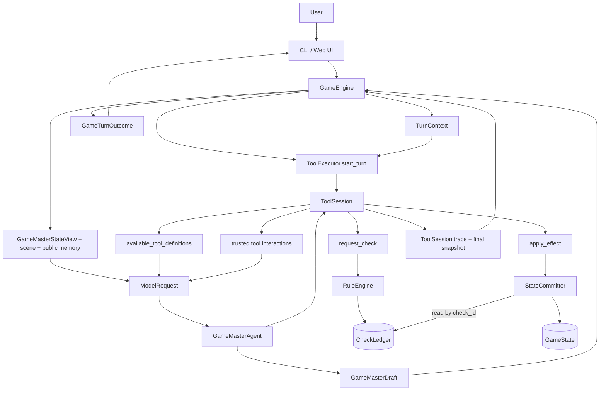

# 系统架构

## 文档状态

本文档是 Monmusu Agent MVP 的现行目标架构。架构决策以 [ADR-001](adr/0001-single-gm-agent-and-character-tools.md)、[ADR-002](adr/0002-lightweight-player-facing-mvp-loop.md)、[ADR-003](adr/0003-single-effect-game-state-commit.md) 和 [ADR-004](adr/0004-user-input-gameengine-turn-contract.md) 为依据，单轮执行细节以 [回合循环](turn_loop.md) 为准，字段定义以 [JSON 数据契约](schemas.md) 为准。

当前源码已经实现外层 GameEngine 回合、有限 GameMasterAgent 循环、两个确定性工具和可信结果组装。角色生成、Memory 写入、正式 EventLog、真实 LLM adapter 和连续 CLI 仍是后续切片。

## 架构目标

- 8 周内完成可演示、可完整游玩的 MVP。
- 系统中只有一个拥有工具调用循环的 Agent：`GameMasterAgent`。
- AI 队友是隔离上下文的角色生成结果，不是独立 Agent。
- `GameMasterAgent` 直接理解用户原文；运行时不实现 ADR-002 已取代的外围语义路由层。
- 规则、权限和正式状态由确定性代码控制。
- LLM 输出必须经过 schema、工具权限和状态边界验证。
- 普通回合按需调用 0-1 个角色，任一回合最多调用 2 个角色。
- 每轮保留可观察的工具轨迹、检定结果、状态提交和降级原因。

## 核心原则

### 单一 Agent Loop

`GameMasterAgent` 只能在受控预算内调用动态目录中的工具。当前目录支持申请检定和提交受验证的状态效果；角色回应和记忆写入会在后续 MVP 切片加入。其他 LLM 调用都封装在工具内部，不能继续调用工具或开启递归回合。

### 最小回合上下文

`GameEngine` 只把机械事实写入内部 `TurnContext`：`turn_id`、用户原文、初始 GameState 快照、总工具步骤和各工具配额。可用工具由 `ToolSession.available_tool_definitions()` 动态提供，不在上下文中维护第二份目录。

模型不直接读取 `TurnContext`。GameEngine 从可信数据确定性生成 `GameMasterStateView`、当前场景投影和公开记忆快照；GameMasterAgent 每一步把它们与动态工具目录、此前工具交互组装为 `ModelRequest`。用户意图、是否需要澄清以及快速、戏剧或紧迫策略由模型理解和选择。

策略不会授予额外权限。`ToolExecutor`、`RuleEngine` 和 `StateCommitter` 继续验证每个工具请求、行动授权和正式效果。

### 单一 GameState 写入边界

当前 `StateCommitter` 是 `GameState` 的唯一效果写入边界，一次只接受一个固定 `effect_id`，并原子写入一个 GameState 文件。Memory、EventLog、关系阶段和跨文件事务尚未接入该边界；它们属于后续 MVP 切片，不能被描述为当前 `apply_effect` 已提供的能力。

### 角色上下文隔离

计划中的 `generate_character_turn` 只读取目标角色的 `CharacterProfile`、该角色的私有记忆、公开场景、公开线索和本轮参与目的。它不能读取其他角色的私有记忆，也不会把自己的私有上下文直接返回给 `GameMasterAgent`。

### 候选内容不是事实

`CharacterTurnProposal`、GameMasterAgent 的工具参数和状态效果申请都是候选内容。只有确定性模块确认的 `CheckResult` 和状态为 `applied` 或 `already_applied` 的 `CommitResult` 才能支持正式机械叙事；`no_state_change` 只能说明没有新增机械变化，`rejected` 不能成为事实。

## 架构总览



图中实线是当前已实现的回合和工具切片。`generate_character_turn`、`update_memory`、Memory 写入边界和 EventLog 是后续 MVP 切片，只有实现并加入动态工具目录后，GM 才能调用。场景和已发现线索已经由 GameEngine 投影，不再规划 MVP 查询工具。各名称表示职责边界，不要求每一项都实现为独立服务。

## 核心组件

### GameEngine

外层回合控制器。

职责：

- 通过 `run_turn(input_text)` 接收一次合法用户原文；MVP 不接收触发类型或结构化系统事件。
- 在分配 `turn_id` 前读取并校验 GameState、Memory 和本轮所需静态数据，并拒绝已经结束的游戏。
- 创建稳定的 `turn_id`、只读初始 GameState、最小 `TurnContext`、模型安全状态投影、场景上下文和公开记忆快照。
- 为本轮确定 `max_tool_steps` 和每工具 `tool_limits`；外层 Agent 迭代上限由注入的 GameMasterAgent 持有。
- 调用 `ToolExecutor.start_turn(context)` 创建本回合唯一 ToolSession。
- 启动并终止 `GameMasterAgent` 的有限工具循环。
- 校验模型只返回的 `GameMasterDraft`，并从 ToolSession 轨迹与最终状态快照组装 `GameMasterTurnResult` 和 `GameTurnOutcome`。
- 在已知 Agent/Draft 失败时保留既有机械结果并进入确定性降级；数据损坏、配置错误和意外异常继续抛出。

`GameEngine` 不创作正常叙事或角色台词，也不自行解释骰子结果。当前它读取 Memory 但不写 Memory，也不持久化 EventLog。

### TurnContext 与语义路由

`TurnContext` 是 `GameEngine` 创建的只读机械上下文，不负责理解自然语言。

- 用户原文保持原样进入上下文。
- 不保存 `RoundTrigger`、`trigger_type`、`allow_state_changes` 或跨回合角色授权 ID。
- 当前工具配额写入 `tool_limits`；ToolSession 再根据实现能力、权限和剩余配额生成动态目录。
- `GameMasterAgent.max_iterations` 在构造时注入，不由模型修改；真实网络超时由后续 adapter 配置。
- `GameMasterAgent` 负责理解点名对象、行动意图、是否需要澄清以及采用哪种回合策略。

角色机械行动授权只接受本轮 `user_declared` 或 `user_delegated` 证据。无状态角色反应可以叙事；跨回合分工和模组紧急反应若未来需要机械权限，应使用新契约而不是恢复删除字段。

MVP 不实现额外的外围语义路由，也不保留面向多个独立 Agent 的 `ParticipationPlanner`、`AuthorityValidator` 或 `ResolutionPlanner`。其中仍有价值的硬规则分别进入 `TurnContext`、角色工具参数、`ToolExecutor` 权限验证和 `StateCommitter` 状态验证。

### GameMasterAgent

系统中唯一拥有有限 agent loop 的组件。

职责：

- 理解用户本轮目的。
- 判断是否需要澄清，并选择快速、戏剧或紧迫策略。
- 从每一步 `ModelRequest.available_tools` 的动态目录中选择工具；该目录直接来自 ToolSession。
- 普通回合决定是否需要 0-1 个角色发言、建议或提出行动；任一回合最多 2 个角色。
- 请求确定性检定，并忠实使用返回结果。
- 在模组边界内组织场景、角色回应、检定后果和最终叙事。
- 在必要时请求受验证的状态效果；记忆工具实现后，才可请求受限记忆更新。
- 完成工具循环后只返回 `GameMasterDraft(strategy, narration, suggested_actions)`。

禁止：

- 直接读取任意角色私有记忆。
- 读取完整 `TurnContext`、`turn_id`、原始工具预算或完整 GameState。
- 直接修改 `GameState`、骰点、目标值或成功等级。
- 调用当前动态工具目录中不存在的工具。
- 把未授权的角色机械行动或普通建议叙述为已经发生。
- 提交检定、状态提交、角色结果、结局或工具轨迹作为最终结果字段。
- 自行开启新回合、递归创建 Agent 或突破迭代预算。

### ToolExecutor

所有 GM 工具调用的唯一入口。`ToolExecutor.start_turn(context)` 为每个外层回合创建一个独立 `ToolSession`。

职责：

- 通过 `ToolSession.available_tool_definitions()` 返回此刻仍可调用的动态工具目录；这是 GM 唯一可信的工具清单。
- 通过 `ToolSession.execute(tool_name, arguments)` 校验工具名、参数、总步骤和每工具配额。
- 为每次调用分配 `tool_call_id`，记录规范化参数、是否分发、结果和拒绝原因；该 ID 只有轨迹意义。
- 对 `request_check` 先做 schema 和工具预算预检；预检失败直接返回 `ToolError`，不调用 `RuleEngine`，也不生成 `check_id`。行动与授权语义由 RuleEngine 验证。
- 将 `request_check` 转换为 `RequestCheckArgs`，将 `apply_effect` 转换为 `ApplyEffectArgs`；GM 不能构造内部来源对象或模组 operation。
- 每次 `apply_effect` 返回后重新读取 GameState，刷新会话快照和 `current_state_version`，包括 `rejected` 或 `no_state_change` 结果。
- 向 GameEngine 暴露不可变的 `final_state_snapshot` 和完整 `trace`；向模型返回的工具结果会裁掉内部回合关联字段，但保留后续工具所需标识和 `context_delta`。
- 使用统一 `ToolResult` 返回确定性结果。参数预检失败消耗一个总工具步骤，但不消耗该工具的分发配额。

当前实现目录只包含 `request_check` 和 `apply_effect`。角色生成和记忆能力只有在各自实现、验证并加入动态目录后才存在。`ToolResult.ok=true` 只表示调用已由可信模块处理；`apply_effect` 是否提交成功仍由 `CommitResult.status` 决定。

### CharacterTurnGenerator

`generate_character_turn` 的计划工具实现，尚未加入当前 `ToolExecutor` 目录。

输入只包含：

- `character_id`。
- `participation_role`，例如主要回应者、协助者或反对者。
- `generation_mode`：独立提议或公开接话。
- 本轮目的。
- ToolExecutor 提供的公开场景快照、关系状态，以及公开接话所需的前序台词。

工具内部读取对应 `CharacterProfile`、该角色的私有记忆和关系状态，然后执行一次受 schema 约束的 LLM 生成。输出为 `CharacterTurnProposal`。

该组件不能：

- 调用其他工具。
- 读取其他角色私有记忆。
- 修改状态或宣布检定结果。
- 替用户、其他角色或主持人作出决定。

### RuleEngine

确定性规则组件。

职责：

- 接收 ToolExecutor 预检通过的 `RequestCheckArgs`；不接收自然语言判断，也不接受模型提供的 `check_id`、骰点或最终目标值。
- 验证行动来源、行动所有者、授权方式、目标和当前场景合法性。
- 根据 `CharacterProfile`、当前状态和 `ModuleStore` 中的静态交互规则选择技能、基础值和场景难度。
- 验证语境理由的来源，并限制 LLM 建议的语境修正范围。
- 在所有验证通过后创建 `check_id`，执行 d100 掷骰并计算成功等级。
- 返回并保存不可被 Agent 修改的 `CheckResult`。
- 根据 `CheckRule.effects_by_outcome` 和实际结果冻结 `allowed_effect_ids`；开放检定返回空数组。

#### 检定实例与权威记录

GameMasterAgent 只判断“是否需要检定”并提交行动描述、目标、建议技能、建议修正、理由和授权证据。它不能创建检定实例，也不能提供 `check_id`、`base_skill`、`difficulty_modifier`、`target`、`roll` 或 `outcome`。

ToolExecutor 先完成工具白名单、schema、预算、只读限制和调用资格预检；通过后才把请求交给 RuleEngine 做语义验证。RuleEngine 在行动者、授权、目标、场景、技能来源、静态规则和修正理由全部验证通过后，才在本局游戏范围内生成单调递增的 `check_id`，然后原子地创建并掷出该检定。

`CheckLedger` 是 GameEngine 内部的逻辑职责，不要求实现为独立服务。MVP 物理上将它序列化为独立的 `var/check_records.json`（或等价的独立持久化集合），不属于 `GameState`、Memory 或 EventLog。它按 `game_id` 保存不可变的完整 `CheckResult`，并在检定成功创建后立即持久化；检定记录在本局生命周期内保留，不因最终叙事、状态提交或回合结束删除。StateCommitter 通过 `check_id` 对 `CheckLedger` 执行只读查询，并以记录中的 `allowed_effect_ids` 为授权快照，不能信任 `apply_effect` 或最终结果中重复提交的检定字段。

schema 非法、行动未授权、目标不存在、静态规则不匹配或检定预算耗尽时，只记录工具拒绝和原因，不创建 `check_id`、`CheckResult` 或检定记录。已经创建的检定即使后续状态提交失败也不得重掷、覆盖或重新生成。

检定公式保持为：

```text
target = clamp(base_skill + difficulty_modifier + context_modifier, 5, 95)
success = roll <= target
```

用户行动的 `suggested_context_modifier` 限制在 -10 到 +10，角色行动限制在 -5 到 +5；最终采用值由 `RuleEngine` 决定。

### StateCommitter

当前 MVP 切片中 `GameState` 的唯一效果写入边界。

职责：

- 接收单个 `ApplyEffectArgs`：`expected_state_version + source + effect_id + reason`。
- 只接受两类来源：当前回合的 `check_id`，或模组静态 `event_rule_id`；`tool_call_id` 不能授权状态效果。
- 当效果引用 `check_id` 时，从 `CheckLedger` 查询唯一 `CheckResult`，并验证 `effect_id` 是否存在于冻结的 `allowed_effect_ids`。
- 当效果引用 `event_rule_id` 时，验证场景、重复策略、模组条件和该规则绑定的唯一效果。
- 从模组 `effect_definitions` 读取固定 operations，校验路径、操作、数值范围、场景边界和 `expected_state_version`；GM 不提供补丁。
- 对一个 effect 的全部 operation 先在内存副本中预演，全部成功后才原子替换一个 GameState 文件。
- 用 `commit_metadata` 实现幂等与“同一来源至多选择一个效果”，返回 `applied`、`already_applied`、`no_state_change` 或 `rejected`。

`GameMasterAgent` 只能通过 `ToolSession.execute("apply_effect", ...)` 间接请求该边界。当前原子范围不包含 Memory、EventLog、关系阶段或跨文件事务；这些能力不得通过扩展 `reason` 或复用 `tool_call_id` 绕过。

### ModuleStore

提供只读模组事实。

- 城市事实来自 `thalarion_setting.md` 对应的数据配置。
- 场景、线索、时钟和结局来自 `game_design.md` 对应的数据配置。
- GameEngine 只投影当前场景、公开发现机会、已发现线索和模组声明的 GM 可见 flags。
- 未解锁线索不能因为 Agent 猜测而成为已发现事实。

### MemoryStore

Memory 文件保存公开记忆、角色私有记忆、关系状态和未解决问题。当前 `StateCommitter.apply_effect` 不写入这些数据。

- GameEngine 在分配 `turn_id` 前校验 Memory 的 `schema_version`、`game_id` 和 `public_memory`，再把公开记忆作为本轮固定快照放入 `ModelRequest`。
- `GameMasterAgent` 只能读取该公开快照和工具主动返回的可见摘要；当前回合不写 Memory。
- `generate_character_turn` 只能读取目标角色的私有记忆。
- 后续 `update_memory` 根据事件来源和可见性把内容路由到正确分区；接口尚未冻结。
- 私有内容只有在角色实际披露后，才能转入公开记忆。
- Memory 不复制 GameState 的 `state_version`；未来需要并发控制时使用独立 `memory_version`。

### GameMasterModel adapter / LLMClient

当前源码用 `GameMasterModel.next_step(ModelRequest)` 协议隔离模型；真实 adapter 和共享 `LLMClient` 尚未实现。

- adapter 只把 `ModelRequest` 序列化为真实 LLM 请求，并把响应解析为 `FinalModelStep` 或 `ToolCallModelStep`。
- 未来 `LLMClient` 可供 `GameMasterAgent` 和 `CharacterTurnGenerator` 共用，统一模型配置、超时和用量记录。
- 不拥有游戏规则、状态写入权或跨角色记忆访问权。
- 模型提供方与具体 API 由配置决定，不进入领域组件。

### 结构验证与 EventLog

- ToolSession 负责工具参数预检，RuleEngine / StateCommitter 负责领域验证，GameEngine 负责 `GameMasterDraft` 的最终结构验证；当前不要求额外实现一个通用 `SchemaValidator` 类。
- 当前 `ToolSession.trace` 已记录工具轨迹，并由 `GameTurnOutcome` 返回调用层。后续 EventLog 可持久化用户输入摘要、策略、`check_id` 引用、提交结果和降级原因；它不是当前 StateCommitter 的原子写入目标。
- 日志中的私有字段必须按角色隔离，普通调试视图不得聚合显示全部私有记忆。

## Agent 工具目录

GM 每一步只能使用 `ModelRequest.available_tools` 当时提供的定义；该字段直接来自 `ToolSession.available_tool_definitions()`。系统提示词和先前请求不能成为第二套工具目录。

| 工具 | 状态 | 作用 | 主要限制 |
| --- | --- | --- | --- |
| `request_check` | 已实现 | 请求 RuleEngine 执行检定 | Agent 只能建议检定意图、技能和语境修正；不能提供 `check_id` 或结果 |
| `apply_effect` | 已实现 | 申请一个规则或模组事件允许的固定效果 | 只接受 `check_id` / `event_rule_id` 来源；GM 不提供 operation |
| `generate_character_turn` | 计划中 | 生成一个角色的台词与行动提议 | 需要角色上下文隔离和独立预算 |
| `update_memory` | 计划中 | 请求写入公开或私有记忆 | 需单独冻结可见性、幂等和持久化契约 |

工具参数和返回字段以 [JSON 数据契约](schemas.md) 为准。

## 状态权威

| 数据 | 读取者 | 唯一写入者 |
| --- | --- | --- |
| TurnContext | GameEngine、ToolExecutor、ToolSession | GameEngine 在回合开始时创建；本轮只读 |
| GameMasterStateView / ModelRequest 固定投影 | GameMasterAgent、模型 adapter | GameEngine / GameMasterAgent 从可信输入组装；本轮只读 |
| GameMasterDraft | GameEngine | GameMasterModel 提供候选内容，不是状态权威 |
| GameMasterTurnResult / GameTurnOutcome | CLI、Web UI、调试组件 | GameEngine 从 Draft、轨迹和最终快照组装 |
| GameState | GameEngine、规则工具 | StateCommitter |
| 模组事实 | GameEngine、RuleEngine、StateCommitter | 版本化模组数据，不在回合中修改 |
| 公开记忆 | GameEngine、GameMasterAgent、角色工具 | 计划中的 Memory 写入边界；当前 GameEngine 只读，`apply_effect` 不写 |
| 某角色私有记忆 | 该角色工具 | 计划中的 Memory 写入边界；当前 `apply_effect` 不写 |
| 角色卡 | 该角色工具、只读配置加载器 | 版本化角色配置 |
| CheckResult | GameMasterAgent、StateCommitter | RuleEngine |
| CheckLedger | StateCommitter、回放与调试组件 | RuleEngine 在验证通过后追加；按 `game_id` 保留唯一记录 |
| ToolSession 轨迹 | GameEngine、调试组件 | ToolSession 在每次调用后追加 |
| EventLog | 调试与回放组件 | 计划中的日志边界；当前 StateCommitter 不写 |

## 失败与降级

- 角色工具超时或输出非法：忽略该角色结果，主持人继续本轮。
- 达到角色调用上限：拒绝额外调用，并把原因返回给 GameMasterAgent。
- 检定参数非法、行动未授权、目标不存在或检定预算耗尽：返回结构化错误，不掷骰、不创建 `check_id` 或检定记录，也不修改状态。
- 状态效果非法：返回 `CommitResult(status="rejected")` 并保留原状态；每次调用只有一个效果，不存在同一调用中的“保留其他合法效果”。
- 模型调用失败、未知步骤或达到循环上限：GameEngine 保留已有确定性结果并返回固定降级 Draft，记录稳定 `failure_code`。
- `GameMasterDraft` 非法：不追加修复模型调用，直接使用 `invalid_draft` 降级。
- GameState、Memory、静态数据或运行依赖非法：在分配 `turn_id` 或调用模型前抛出领域错误，不伪装成降级成功。

任何降级都不能泄露角色私有记忆、重掷既有结果或放宽状态权限。

## 当前实现边界

当前源码已实现初始化、RuleEngine、CheckLedger、GameState-only StateCommitter、只暴露 `request_check` / `apply_effect` 的 ToolExecutor/ToolSession seam，以及完整的单用户输入 GameEngine 外层回合。

`GameMasterAgent` 接收注入的 `GameMasterModel`、内部 `TurnContext` 和 `ToolSession`，但模型每一步只看到安全 `ModelRequest`。循环支持 `FinalModelStep(GameMasterDraft)` 或 `ToolCallModelStep`；工具结果会以只读裁剪副本返回模型。GameEngine 已实现输入与数据预检、模型状态/场景/公开记忆投影、Draft 验证、可信检定和提交聚合、最终结局读取与玩家可见降级模板。

尚未实现的 MVP 组件包括：

- 真实 LLMClient adapter。
- `generate_character_turn`。
- Memory、关系阶段和正式 EventLog 的写入边界。
- 完整 CLI 连续回合与 LLMClient 集成。

这些能力应以测试保护下的独立切片接入动态工具目录，不得为了快速贯通而恢复旧 multi-agent 架构或扩大 StateCommitter 权限。

## 架构验收标准

- 运行时只有 `GameMasterAgent` 拥有工具循环。
- 运行时不存在 ADR-002 已取代的外围路由层。
- 外层回合只接受用户原文，不保存 `RoundTrigger` 或 `trigger_type`。
- GameMasterModel 只接收 `ModelRequest`，看不到完整 `TurnContext`、`turn_id`、原始预算、完整 GameState 或私有记忆。
- GameEngine 在 Agent 启动前校验输入、状态、Memory 和静态数据，并确定固定工具预算。
- `generate_character_turn` 实现后无法读取其他角色私有记忆或调用工具。
- 普通回合最多调用两个角色，且允许零角色调用。
- 所有骰点和成功等级都来自 `RuleEngine`。
- 所有正式 GameState 效果写入都经过 `StateCommitter`，且一次只申请一个固定效果。
- 工具轨迹能说明本轮调用了什么、为什么被允许或拒绝。
- 模型只返回 `GameMasterDraft`；GameEngine 拥有最终结果、轨迹、降级状态和结局字段。
- 任一 LLM 调用失败时，游戏仍能以保守结果结束当前回合。
